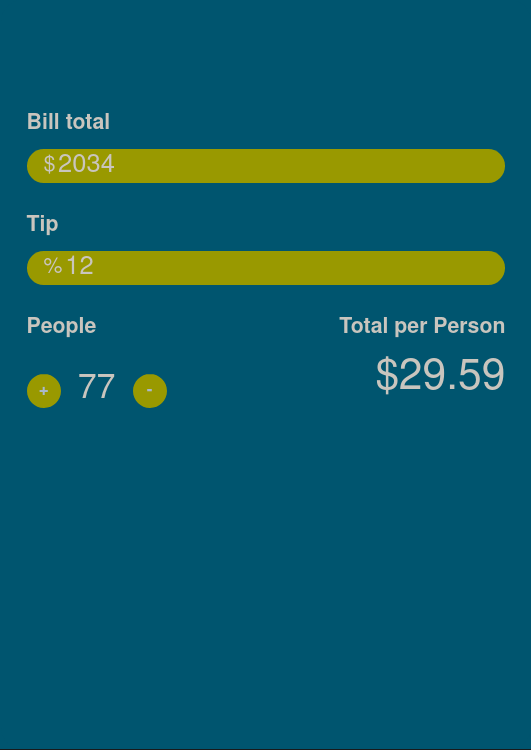

# tip-calculator

Why did the tip calculator break up with the restaurant? It just couldn't handle the exorbitant bills and the constant percentage games. So it decided to make its own web app with vanilla JS!

Live preview of tip-calculator application:
[tip-calculator](https://sdooodly.github.io/tip-calculator/)


Use the command below to clone this repo! 
```bash
git clone https://github.com/sdooodly/tip-calculator.git
```

Toodles! (:
## Credits
[JS course by Clever Programmer](https://www.youtube.com/watch?v=lI1ae4REbFM)

